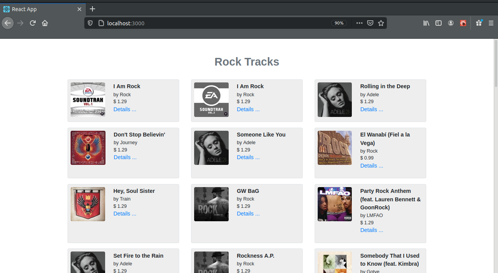
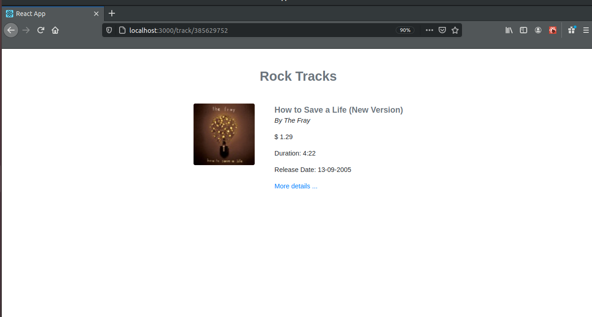

# Rock Tracks app

## Overview

This is a React/Redux SPA application that connects to an [Apple REST web service](https://itunes.apple.com/search?term=rock&media=music) and returns a list of rock tracks. It consists of two screens: Tracks screen with a list of tracks and second screen with a detailed view of the selected track. There is a "more details" button on second screen which launches the browser and load the trackViewUrl.

## Running The Project

From the repo:

1. Clone this repo into your local machine.
2. Run `cd Rock-Tracks` in your bash/command line
3. Run `npm install` in your bash/command line.
4. Run `npm start` in your bash/command line.
5. Open [http://localhost:3000](http://localhost:3000) to view it in the browser.
6. `npm test` to run tests

## Tech Used / Dependencies

- This project was bootstrapped with [Create React App](https://github.com/facebook/create-react-app).
- Functional component with react hooks were used to create views.
- State management (Redux): <br />
  When first screen loads it makes api call to fetch a list of tracks. This data is saved to Redux store. Track details screen (screen 2) url contains trackId, which can be accessed through `useParams()`, a react-router hook. This screen has also access to redux store via `useSelector()`, a react-redux hook. `useSelector()` hook looks for the track in Redux store which has the same id as trackId in the page url. If there is no track with the given trackId a new api call is made to fetch the data only for this trackId. <br />
  Every time when user returns from track details screen to first screen, Tracks component checks if there is data in Redux store, in case there is not any data the component dispatch `fetchTracks()` action creator, which connects to an Apple REST web service and retrieve the data from there.
- Instead

```
connect(mapStateToProps,  mapDispatchToProps)(Component)
```

`useSelector()` and `useDispatch()` react-redux hooks were used.

- `Redux "thunk"` middleware for async logic
- The `Redux DevTools Extension` to track the history of the changes to the state in Redux store over time.
- React router was used to create two routes
- `Moment.js` was used to formate release date and track duration.
- `React.PropTypes` package to run typechecking on the props for components
- [Prettier](https://www.npmjs.com/package/prettier) to format code.
- Bootstrap

## Improvement

1. Add more tests
2. Use async/await syntax
3. Improve folder structure
4. Axios instead of Fetch
5. When Tracks component get data from Apple REST web
   service it is saved directly to Redux store, however before saving the data could be cleaned (remove all details which are not used on screens).

## App Preview

Tracks (screen 1) <br />



Detailed view of the selected track (screen 2)<br />


